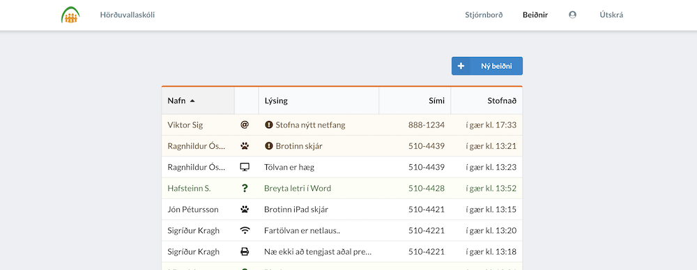

<div align="center">

# [Tikket](https://tikkety.herokuapp.com) 
[]() []() [](https://travis-ci.org/dingolfsson/tikket) 
[](https://codeclimate.com/github/dingolfsson/tikket/maintainability) [](https://codeclimate.com/github/dingolfsson/tikket/test_coverage)  [](https://snyk.io/test/github/dingolfsson/tikket) [](http://inch-ci.org/github/dingolfsson/tikket) 

 
 [React](https://reactjs.org/) / [Semanti UI](https://react.semantic-ui.com)
</div>


## Sýnishorn



## Niðurhal og Uppsetning
* Sækja repo: `git clone https://github.com/dingolfsson/tikket.git`
* `cd tikket`
* Uppsetning: `npm i`
* Stofna Firebase Project: https://firebase.google.com/
  * Authentication: Sign-in method `Email/Password`
  * Database: Cloud Firestore
* 
  <details><summary>Firestore stillingar</summary>
    <p>

    ```javascript
    service cloud.firestore {
      match /databases/{database}/documents {
        match /projects/{project} {
          allow read: if request.auth.uid != null
          allow write: if request.auth.uid != null
        }
        match /tickets/{ticket} {
          allow read: if request.auth.uid != null
          allow write: if request.auth.uid != null
          allow update: if request.auth.uid != null
        }
        match /users/{userId}{
          allow create: if request.auth.uid != null;
          allow read: if request.auth.uid != null
          allow write: if request.auth.uid == userId
        }
        match /notifications/{notification} {
          allow read: if request.auth.uid != null
        }
      }
    }
    ```

    </p>
    </details>

* 
  <details><summary>.env uppsetning</summary>
    <p>

    ```
    REACT_APP_API_KEY = apiKey
    REACT_APP_DOMAIN = authDomain
    REACT_APP_DATABASE = databaseURL
    REACT_APP_PROJECT = projectId
    REACT_APP_STORAGE = storageBucket
    REACT_APP_MESSAGE = messagingSenderId
    ```

</p>
</details>

## Notkun

### Grunnur

Eftir að hafa sótt vefinn þarf að stofna aðgang hjá Firebase. Virkja þarf `Email/Password` auðkenning og stofna Firestore gagnagrunn.

Firestore stillingarnar fyrir Firebase og Firestore eru fyrir ofan, einnig hvernig `.env` skal vera uppsett.

## Aðstoð / Pöddur / Ábendingar

**[Smelltur hér til að tengjast Slack rásinni](tikket.slack.com)**